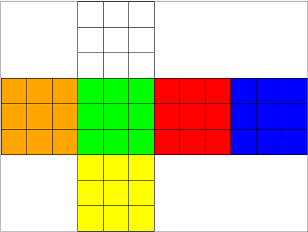
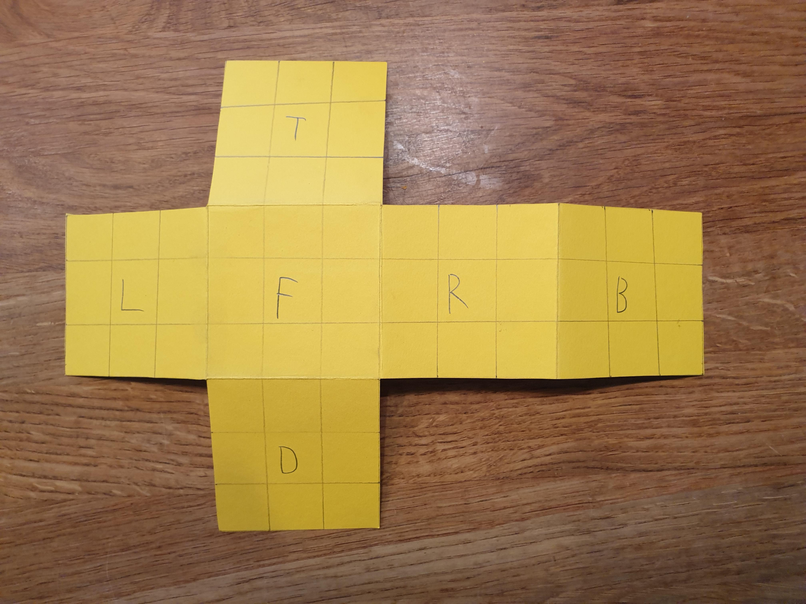
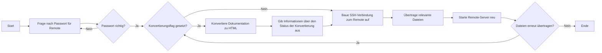
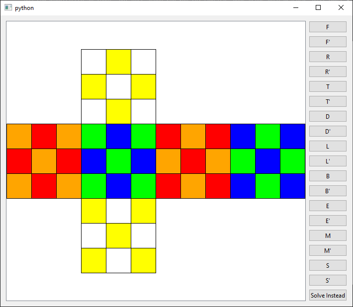
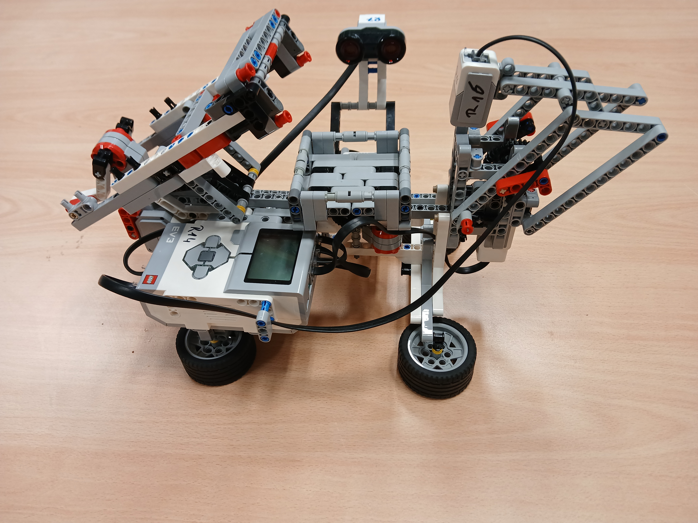
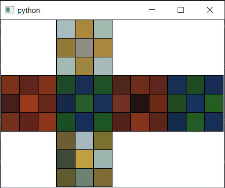
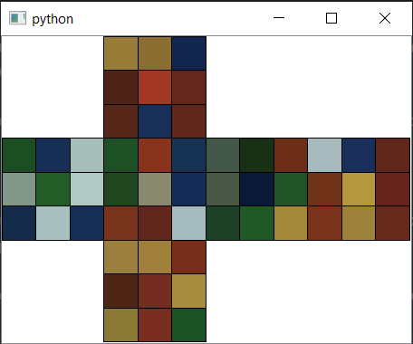
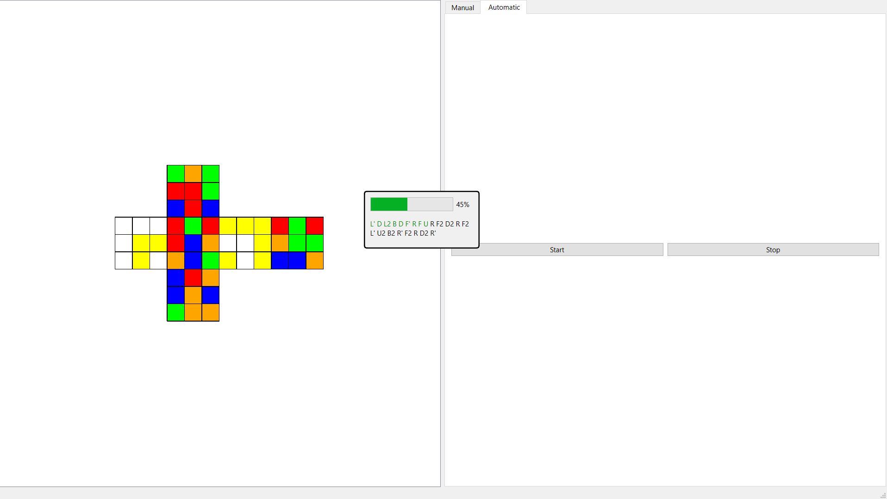
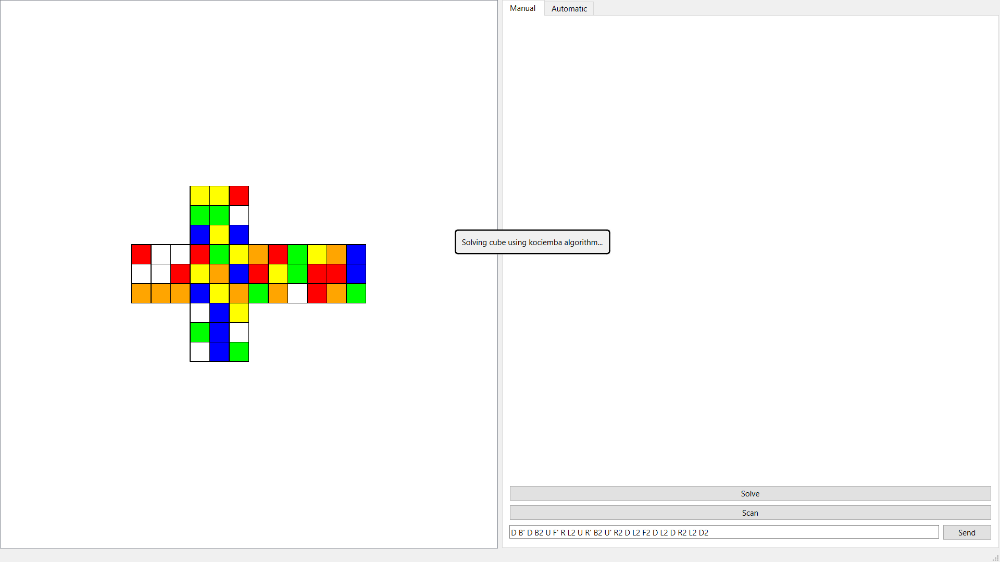

# Tagebuch

!!! info "Fremdwörter"

    Da in dieser Dokumentation einige nicht umgangssprachliche oder programmierspezifische Wörter genutzt werden, ist
    bei deren Verwendung meist eine kleine Zahl angegeben. Diese ist ein Link zu einer Fußnote, in der das Wort näher 
    erklärt wird.

Die Tage 1–5 beziehen sich auf Arbeitstage, die Tage danach allerdings auf \*echte* Tage.

## Tag 1

Würfelobjekt erstellt. Die einzelnen Seiten können verschiedene Farben haben.

## Tag 2

Bessere — lesbare — Ausgabe der Würfelobjekte erstellt.

## Tag 3

Zugriff auf einzelne Seiten des Würfels / mehrere Seiten erleichtert.

## Tag 4

Nach langer Pause grafische Darstellung des Würfels erstellt. Dabei aus Bequemlichkeitsgründen die Struktur einer
Würfelseite geändert.

```
[W, W, W, W, W, W, W, W]
```
-->

```
[
    [W, W, W],
    [W, W, W],
    [W, W, W]
]
```

Ein Bild aus der GUI:



## Tag 5

Erste Drehungen hinzugefügt: die Vorderseite im Uhrzeigersinn(`f`) und die Vorderseite gegen den Uhrzeigersinn(`f'`).
Diese Drehungen sind auch auf der GUI zu sehen.

## Tag 6 - 26.8.2024

Heute war der erste Schultag im neuen Schuljahr, an dem unser Lehrer uns gesagt hat, dass wir jeden Tag etwas ins
Tagebuch schreiben sollen, und nicht nur an den Tagen, an denen wir an dem Projekt arbeiten. Ich werde versuchen, das
umzusetzen, auch wenn ich nicht weiß, ob es zu 100 % geht.

Nachdem ich den kurzen Text oben geschrieben habe und mich mit Problemen der Darstellung von geschützten Leerzeichen (
` `) beschäftigt habe, habe ich keine Lust, auch noch zu programmieren. Habe aber grade doch noch
das Fremdwortregister hinzugefügt.
!!! note "Notiz"

    Das Fremdwortregister wurde am 22.9.2024 in Fußnoten geändert. Die Fremdwörter können dort (am Ende des Dokuments)
    eingesehen werden.

Später (15:33) doch noch die nächsten zwei Drehungen hinzugefügt. Diese sind `r` (rechte Seite im Uhrzeigersinn) und
`r'` (rechte Seite gegen den Uhrzeigersinn).

## Tag 7 - 27.8.2024

Ich habe heute keine Lust zum Schreiben. Habe gerade die Drehbewegungen in eine JSON[^2]-Datei verfrachtet.
Ein Beispiel aus dieser JSON-Datei (gekürzt, weil es statt 2 Bewegungen der Plättchenfarben (der Cubies, kleinerer 
Unterwürfel) immer exakt 5 gibt, eine zum Drehen der Hauptseite und 4 zum Drehen der Ränder):

```json
{
  "moves": {
    "f": [
      {
        "face": "front",
        "counterclockwise": true
      },
      {
        "from_face": "top",
        "from_type": "horizontal",
        "from_index": 2,
        "to_face": "right",
        "to_type": "vertical",
        "to_index": 0
      }
    ]
  }
}
```

Jedes der Elemente in dem `f` (front; Vorderseite in Uhrzeigersinn)-Array ist entweder:

* eine Referenz auf einem anderen Zug (, der aus mehreren Bewegungen, oder auch Referenzen, bestehen kann),
* die Drehung einer Seite (nicht deren Kanten) oder
* die Bewegung von einer Reihe/Spalte (Orientierung ist das Feld `from_type`) an Index `from_index` von Seite
  `from_face` zu den Stellen an Seite `to_face`. Ein optionaler Parameter `reverse` bestimmt dabei, ob die ausgewählten
  Farben vor dem Einfügen umgedreht werden sollen.

Die gesamten bis jetzt verfügbaren Drehungen (`f`, `f'`, `r`, `r'`) sind jetzt auf das neue Format umgestellt.

## Tag 8 - 28.8.2024

Wollte heute nichts machen, habe dann aber doch die Drehungen der Oberseite (`t` und `t'`) hinzugefügt.
Die Drehungsdatei hat schon 242 Zeilen!

## Tag 9 - 29.8.2024

Ich habe gerade die Bewegung der linken Seite in die Datei eingegeben. Beim Testen ist mir aufgefallen, dass das
`reverse`-Argument[^1] nicht an die Drehfunktion übergeben würde. Eine Katastrophe! Keine Drehung geht mehr! Das heißt,
ich muss mehr als 350 Zeilen neuschreiben! Los geht's...

Es ist doch fast alles OK. Das Problem war nur, dass ich nicht gesehen hatte, dass das Default des `reverse` Arguments
`True` und nicht `False` war. Das habe ich jetzt geändert.

Habe noch schnell die nächsten Bewegungen hinzugefügt (`l` und `l'`).

## Tag 10 - 30.8.2024

Heute habe ich mal einen Tag Pause gemacht und darüber nachgedacht, wie ich das mit dem Lösen hinkriegen will.
Korfs Algorithmus (eng. `Korf's algorithm`) ist die beste Lösung, um einen Zauberwürfel zu lösen. Sie braucht maximal 20 
Züge. Weniger geht oft, aber nicht immer. Die Anleitung ist 6 Seiten lang und auf Englisch. Die erste Seite habe ich 
schon gelesen, aber mehr als, dass es $\frac{8! \cdot 3^8 \cdot 12! \cdot 2^{12}}{12} = 43.252.003.274.489.856.000$, 
also 43 Trillionen Kombinationen gibt, habe ich nicht verstanden.

## Tag 11 - 31.8.2024

Wenn ich dieses Tagebuch so weiterführe, wird es am Ende niemand lesen, weil es so lang ist. Ich habe allerdings nicht
vor, es kürzer zu fassen.

Ich wollte gerade eigentlich noch die letzten beiden 90° Seitendrehungen hinzufügen (`b` und `b'`; back, hinten), hab es
aber nicht hingekriegt, weil die Kanten von rechts nach links umgreifen, und es daher schwer zu verstehendes ist.
Jetzt habe ich einen echten aufklappbaren Würfel zu bauen, damit ich nicht so viel denken muss und die zu bewegenden
Streifen einfach ablesen kann. :)

## Tag 12 - 1.9.2024

Heute habe ich den oben genannten Würfel gebaut.


## Tag 13 - 2.9.2024

Heute habe ich gemerkt (beim Recherchieren), dass ich die Notation verwechselt habe. Es ist nämlich `R`und nicht `r`.
Das gleiche auch bei allen anderen Zügen, die ich oben verwendet habe. Ich könnte das ändern, werde es aber nicht
machen, weil dies ein Tagebuch und keine exakte Dokumentation ist.

## Tag 14 - 3.9.2024

Nachtrag:
Ich habe keine Ahnung, warum ich hier keinen Eintrag gemacht habe.

## Tag 15 - 4.9.2024

Hier wollte ich eigentlich einen Eintrag machen, kann mich aber nicht mehr erinnern, was ich an diesem Tag gemacht habe.

## Tag 16 - 5.9.2024

Heute habe ich ChatGPT gefragt, wie Korfs Algorithmus funktioniert. Ich glaube, verstanden zu haben, dass der
Algorithmus alle möglichen Kombinationen an Zügen von 1 Zug zu 20 Zügen durchgeht und für jede Zugfolge die
Heuristik[^2] berechnet, um herauszufinden, welche Kombination am Wahrscheinlichsten zum Erfolg (gelöster Würfel) führt.

Die Heuristik habe ich noch nicht implementiert, aber dafür kann das Programm einen Würfel mit wenigen Drehungen lösen,
sofern der Würfel nicht zu sehr verdreht ist. Das Maximum an Zügen zum Lösen ist 20, das Programm braucht dafür
allerdings mehr als 2 Tage. Sind halt auch mehr als $12^{20}$ Zugkombinationen, die durchlaufen werden müssen. Kurz
nachgerechnet (kann Fehler enthalten) sind das etwa $7.294.063.912.571.299$ Jahre Laufzeit. Das ist länger, als es
Menschen auf der Erde geben wird.

## Tag 17 - 6.9.2024

Heute habe ich die Kopierungsfunktion von `Cube`-Objekten optimiert. Sie ist jetzt etwa doppelt so schnell! Also nur
noch $3.647.031.956.285.649,5$ Jahre …

Damit ich nicht so lange warten muss, werde ich ab Morgen den Code auf `numpy`, ein Python-Package, das in C oder C++
geschrieben ist, und deshalb bessere Laufzeit hat, umstellen. Heute kann ich das leider nicht, da meine Mutter oder mein
Vater mich aus dem Internet geworfen haben, und ich das Package ohne Internet nicht installieren kann.

## Tag 18 - 7.9.2024

Heute habe ich, wie gestern angekündigt, das Projekt auf `numpy` umgestellt. Es ist jetzt etwas schneller. Allerdings
habe ich in der obigen Berechnung nicht bedacht, dass eine Lösung auch aus nur 19 oder weniger Lösungen bestehen kann.
Das macht dann $12^{\sum_{k=1}^{d} k}$ Kombinationen, wobei $d$ für _depth_, also _tiefe_ steht. Das macht dann
mit $d=20$

$$
12^{\sum_{k=1}^{20} k}
$$

Kombinationen. Um das Auszurechnen kann man, wenn man nicht über die Zahlen iterieren will,
die Gaußsche Summenformel nutzen. Sie besagt, dass 

$$
\sum_{k=1}^{n} k = \frac{n(n+1)}{2} = \frac{n^2+n}{2}
$$

Hier die Rechnung, um die Anzahl der Kombinationen herauszufinden.

$$
12^{\sum_{k=1}^{20} k} = 12^{\frac{20^2 + 20}{2}} = 12^{\frac{420}{2}} = 12^{210} = 4,24679 \times 10^{226}
$$

## Tag 19 - 8.9.2024

Ich habe mir gestern noch einmal angeschaut, wie Korfs Algorithmus funktioniert. Es gibt eine Heuristik, die abschätzt,
wie viele Züge man noch braucht, um den Würfel zu lösen. Diese wird für jede Zugfolge ausgeführt. Dann gibt es noch
sogenannte Pattern-Databases, die die Teilinformationen zum Lösen des Würfels beinhalten. Das heißt, der Algorithmus
fügt die kleineren Teilinformationen zusammen, um den Würfel zu lösen.

Das Generieren der Pattern-Databases braucht wohl sehr lange, und ich habe keine kostenlos verwendbare im Internet
gefunden. Das heißt, ich muss sie selbst erstellen. Vielleicht von Hand, aber eher mit einem Hilfsprogramm.

Ich hätte heute auch programmiert, hatte allerdings zu viel damit zu tun, die mathematischen Formeln oben zu
korrigieren. Als das dann ging, musste ich die Dokumentation noch in HTML umwandeln, um zu sehen, ob Firefox 
[LaTeX](explanations.md#latex), das Format für die mathematischen Rechnungen, das ich nutze, anzeigen kann. Das hat 
erstmal nicht geklappt, weil das Encoding nicht `UTF-8`war. Dann gab es Probleme, dass *pandoc*, das Programm, das ich 
zum Konvertieren der Markdown-Datei zu HTML nutze, keine vollständige HTML-Datei produziert hat, sondern nur den Text in
HTML, es fehlten also Meta-Informationen, wie Kodierung, Autor, Skripte, die zur Ausführung benötigt wurden, Style (in 
CSS) etc. Das ging eigentlich ganz einfach zu lösen, ich musste nur ein `-s` (oder `--standalone`) an den Befehl in der
CLI anhängen.

Wenn ich programmiert hätte, statt diesen Text – fast schon ein Buch – zu schreiben, wäre Korfs Algorithmus 
wahrscheinlich schon fertig. :joy:

!!! abstract "Fun Fact"

    Hier stand lange Zeit `FIXME: Why does this symbol not work?`.
    
    Das lag daran, dass pandoc keine Emojis supportet hat. Nach der Umstellung auf *Material for MkDocs* geht es 
    jetzt. Da ich den Kommentar nicht für immer löschen wollte, habe ich diese Infobox hinzugefügt.

## Tag 20 - 9.9.2024

Heute hatte ich wegen Orchester keine Zeit, um zu programmieren und an diesem Tagebuch zu schreiben.

## Tag 21 - 10.9.2024

Heute habe ich nicht programmiert, mich aber etwas mit pandoc auseinandergesetzt. Ich wollte, dass es einen Darkmode
gibt, wenn man ihn im Browser oder in den Betriebssystemeinstellungen aktiviert hat. Das ist extrem schiefgegangen, und
der Text war extrem angezogen / extrem lange Zeilen. Das habe ich nicht hingekriegt zu fixen, und deshalb gibt es jetzt
keinen Darkmode.

## Tag 22 - 11.9.2024

Heute habe ich mir angeguckt, wie man UML-Diagramme in Markdown[^3] einbettet.

Dann habe ich angefangen, die [Was ist Markdown-Sektion](explanations.md#markdown) anzufangen. Gerade war ich bei dem 
$\LaTeX$-Teil, als ich gemerkt habe, dass die Gleichung oben (Ende des Eintrags an [Tag 18](#tag-18-792024)) falsch war.
Das habe ich jetzt korrigiert. Ich habe die Gaußsche Summenformel nur falsch wiederholt.

Habe jetzt den Abschnitt über Markdown fertig. Musste etwas herumprobieren mit dem letzten Code-Block, weil Markdown den
zu HTML konvertieren wollte.

Jetzt existiert auch noch der Abschnitt über [$\LaTeX$](explanations.md#latex).

## Tag 23 - 12.9.2024

Heute habe ich mich um ein Darkmode in CSS für die Dokumentation gekümmert. Manche Sachen sehen noch seltsam aus, aber
der Großteil geht schon. Es gab noch Probleme mit den `invert`-Filter in CSS, weil der alle Farben eines Objekts
umdreht, also auch die Auswahlfarbe, und nicht nur die normalerweise Sichtbare.

## Tag 24 - 13.9.2024

Heute habe ich an dem Darkmode weitergemacht. Das Problem mit `invert` hat sich jetzt geregelt, nachdem ich ein Programm
geschrieben habe, das Hexadezimalfarben umkehrt. Dann habe ich noch das Inhaltsverzeichnis nach links an den Rand 
geschoben, damit es immer sichtbar ist. Es hat jetzt einen Schatten und eine Hover-Animation.

## Tag 25 - 14.9.2024

Heute habe ich auf einem Raspberry Pi einen kleinen Server aufgesetzt, der jetzt in unserem lokalen Netzwerk läuft. Er
stellt dieses Tagebuch zur Verfügung, so dass man es von allen Geräten im Netzwerk abrufen kann. Der Server läuft mit
`flask`, einem Python-Modul für Server. Die Dateien muss ich bei jeder Änderung über PSFTP (PuTTY Secure FTP, einem
FTP-Programm von PuTTY) neu pushen. Damit ich nicht immer jede einzelne Datei bei jeder einzelnen Änderung von Hand
übermitteln muss, habe ich mir von ChatGPT ein Bash-Skript erstellen lassen, das das Password für den Remote-User 
abfragt, eine Verbindung über PSFTP aufbaut und die Dateien überträgt. Der Server lässt sich im Browser öffnen, die 
IP-Adresse ist `192.168.178.59`. Diese Adresse geht nur in diesem Netzwerk, in jedem anderen würde ein anderes Gerät 
angesprochen.

Als ich mir heute diesen Text durchgelesen habe, habe ich so viele Fehler gesehen, dass diese nicht mehr auf eine Seite
Text passen. Unter anderem war die Tag-Nummerierung komplett falsch. 10 und 11 gab es doppelt. Diesen Fehler habe ich
jetzt behoben, den Rest noch nicht.

## Tag 26 - 15.9.2024

Heute habe ich weiter an meinem sinnlosen Server programmiert. Dazu habe ich ein Bash Skript erstellt, das ein paar
nacheinander Schritte ausführt.
Hier ein Pseudocode (als UML-Ablaufdiagramm, erstellt mit Mermaid):

!!! note

    Ursprünglich war der Code in *PlantUML* geschrieben, wegen späteren Änderungen des Markdown-zu-HTML-Konvertierers
    jetzt aber in *Mermaid*.



## Tag 27 (16.9.2024) - Tag 32 (21.9.2024)

In diesem langen Zeitraum hatte ich andere Sachen zu tun, als zu Programmieren. Allerdings habe ich mir überlegt, wie
ich den Löse-Algorithmus programmieren werde. Da Korfs Algorithmus eine Heuristik und eine riesige Datenbank für die
Teilschritte nutzt, und ich keine Ahnung von Heuristiken (die Benötigte heißt irgendwie *IDA** oder so, das ist glaube
ich eine Heuristik, die nie über dem Ziel liegt/voraussagt) habe, habe ich mich dazu entschieden, ersteinmal einen
Algorithmus, der den Würfel mit den gleichen Lösungen wie ein normaler Mensch (, der den Würfel lösen kann) löst, zu 
implementieren. Damit der Roboter/die Maschine nicht immer 50–100 Schritte zur Lösung des Würfels ausführen muss, werde 
ich eine Datenbank programmieren, die die einzelnen Schritte vereinfacht, z. B. `FFF` --> `F'`.

## Tag 33 - 22.9.2024

Heute habe ich keine Zeit mehr zu schreiben, weil meine Schwester an den Laptop will. Ich werde es morgen nachtragen.

Nachtrag:
Oder auch heute noch. Heute bin ich von *pandoc* (Programm zum Konvertieren von Markdown zu HTML) auf
*Material for MkDocs* umgestiegen. Letzteres erstellt vollständige HTML-Seiten, mit Inhaltsverzeichnis, anderen
Themen/Artikeln, stellt eine Suche bereit und unterstützt auch mobile Endgeräte. Allerdings supportet
*Material for MkDocs* kein *PlantUML* (mit dem das Ablaufdiagramm oben ursprünglich erstellt wurde), sondern nur
*Mermaid* (etwas Ähnliches). Habe jetzt das obige Ablaufdiagramm zu Mermaid geändert. Hat ewig gebraucht, und das, 
obwohl das Skript gar nicht mehr genutzt wird.

Habe jetzt noch das Fremdwortregister in Fußnoten umgeändert und oben eine solche Notiz hinzugefügt.

## Tag 34 - 23.9.2024

Gestern habe ich noch einen Fehler in einer Drehung gefunden. `B'` hat nur Mist gemacht. Das lag daran, dass von einer
Seite ein Streifen zu einer anderen Seite kopiert wurde, die ursprüngliche Seite aber gedreht wurde, und daher manche
Steine (auch Cubies genannt) vervielfältigt wurden.

Ich installiere gerade Rust und ein \*paar* Packages. Das braucht ewig! Ich hasse Rust jetzt schon … Warum braucht 
das zum Kompilieren so lange? Hat aber schon 200 von 269 Paketen. Habe grade boch gesehen, dass immer 4 Pakete 
gleichzeitig verarbeitet werden. Macht's aber auch nicht besser … Jetzt warte ich schon 15 Minuten.

Hat immer noch nicht installiert, dafür habe ich jetzt die nächsten Bewegungen hinzugefügt. Das sind `S`, `E` und `M`, 
wie immer auch mit `'`. Damit kann man endlich ein Muster machen! 


## Tag 35 - 24.9.2024

Heute habe ich den Raspberry Pi den Server für die neue Dokumentation eingerichtet. Das heißt, ein Binary von GitHub 
herunterladen, entpacken, verschieben und ausführbar machen. Zum Glück habe ich ja ChatGPT :joy:

## Tag 36 - 25.9.2024

Heute habe ich im SFN nach einem Mentor/einer Mentorin geguckt und auch jemanden gefunden, der diese Aufgabe 
übernehmen wird. Als ich der Person (hab den Namen vergessen) das Programm zeigen wollte, ist ganz Windows gecrasht, 
weil der USB-Stick, auf dem das Programm war, nicht mehr ging. Ich habe es grad noch mal an meinem Laptop zu Hause 
probiert, Windows sagt nur
!!! warning "Problem an Laufwerk K:"

    Es liegt ein Problem an Laufwerk K: vor. Möchten sie es überprüfen und reparieren oder nicht?

Als ich dann auf `Überprüfen` geklickt habe, hat sich ein Fenster geöffnet, das sich seit ca. 3 Minuten nicht verändert
hat:
!!! bug "Repariere Laufwerk K:"
    
    Wird gescannt und repariert.

Dann kam der Fehler:

!!! failure "Problem beim Reparieren des Laufwerks"

    Das Laufwerk konnte nicht repariert werden. Schließen Sie das
    Dialogfeld, und versuchen Sie anschließend erneut, das
    Laufwerk zu reparieren.

Das ist nicht gut, ich weiß nicht, ob ich noch eine Sicherheitskopie gemacht habe ...

Nächster Versuch, passiert wieder nichts ...

## Tag 37 - 26.9.2024

Ich habe grade das Inhaltsverzeichnis des Tagebuchs verbessert und neue Dokumente ([Erklärungen](explanations.md) und 
[die Startseite](index.md)) hinzugefügt. Dann noch alle Links geändert, so dass sie auf diese Dateien verweisen.

Da dieses Dokument (Tagebuch) dann nur noch auf einer Überschrift mit nur einem Unterthema war, habe ich die 
Hauptüberschrift entfernt.

## Tag 38 - 27.9.2024

Heute wollte ich wieder programmieren. In PyCharm[^4] kan dann aber die Nachricht, dass eine neuere Version 
verfügbar ist. Diese wollte ich installieren. Also auf `Update` klicken. Dann Restarten, damit die Änderungen übernommen
werden. Dann kam der Fehler, dass ich nicht mehr genug Speicherplatz habe (Ich hatte gestern noch ca. 4 GB). Also,
was macht man sonst, suche ich in den Windows-Speichereinstellungen nach den größten Apps und Ordnern. Dabei habe ich
ein Programm gefunden, das ich nicht mehr brauche. Also will ich es deinstallieren. Geht aber nicht, da meine Dateien
für dieses Programm (`RoboPRO`) noch in den Programmdateien gespeichert waren. Also wollte ich sie auf einen USB-Stick
ziehen. Das ging nach einer 15-minütigen Formation auch. Als ich dann alle PyCharm[^4]-Projekte (ca. 5 GB)
auf den USB-Stick ziehen wollte, hat es voraussichtlich 4 Stunden gebraucht. Dann ist alles abgestürzt und ich habe im
Task-Manager den Explorer geschlossen. Keine gute Idee! Die Taskleiste ist verschwunden, das Programmwechselmenü
(++alt+tab++) und wahrscheinlich auch noch andere Sachen. Die ++win++-Taste ging nicht mehr, ++ctrl+alt+delete++ aber
schon. Nach einem Neustart ging aber alles wieder.

## Tag 39 - 28.9.2024

Heute habe ich mir ein eigenes Logo in InkScape erstellt: 

Das Design habe ich mit ChatGPT ausdiskutiert. Eigentlich sollte es türkis sein, aber das sähe im Header der 
Dokumentation seltsam aus, weil die Farben (Lila und Türkis) nicht gut zusammen aussahen.

Dann habe ich noch die Farben der Dokumentation geändert. Der Header ist jetzt grün (vorher indigo) und die 
Zweitfarbe ist jetzt türkis (welche Farbe es vorher war, weiß ich nicht, Nachtrag: war auch indigo). Ich habe 
mittlerweile mehr Zeit in die Dokumentation gesteckt, als in das Programm. Das muss ich unbedingt ändern.

Habe grade noch sehr viele Rechtschreibe– und Grammatikfehler behoben.

## Tag 40 - 29.9.2024

Hatte heute keine Zeit zum Schreiben, da ich auf einem Geburtstag war.

## Tag 41 - 30.9.2024

Heute wollte ich endlich einen Algorithmus hinzufügen, der einen Stein an die richtige Stelle auf der weißen Seite
bringt, das ging aber nicht, da ich mir den Algorithmus vorher nicht überlegt habe.

## Tag 42 - 1.10.2024

Heute wollte ich – wie gestern auch – den Algorithmus programmieren. Dazu habe ich die Struktur der Bewegungs-JSON-Datei
von [Tag 7](#tag-7-2782024) geändert. Die Referenz ist jetzt kein Objekt mit einem Key mehr, sondern nur ein String.

```json
{
  "reference": "F"
}
```
-->
```json
"F"
```
Jetzt kann man auch mehrere Züge angeben: `"F U' M'"` Dabei werden die Züge durch Leerzeichen getrennt.

## Tag 43 - 2.10.2024

Ich habe grad' mal zu dem Löseroboter recherchiert. Ich werde wahrscheinlich einen Logo-Roboter nutzen, um den Würfel am 
Ende zu lösen. Das benötigte Set ist das
[LEGO MINDSTORMS EV3 (31313) home set](https://www.lego.com/en-us/product/lego-mindstorms-ev3-31313).
Dieses werde ich mir wahrscheinlich ausleihen können.

## Tag 44 (3.10.2024) - Tag 46 (5.10.2024)

In diesem Zeitraum habe ich versucht, ein Update-Programm für [Minecraft-Datapacks](https://minecraft.wiki/w/Data_pack)
zu programmieren. Dies ist aber extrem gescheitert. Wenn ich erklären würde, woran, würde ich nie fertig werden und es
wäre nicht verständlich. Gestern Abend hatte ich eine neue Idee, die umzusetzen würde aber noch länger brauchen.

Allgemein ist diese Idee schwer umzusetzen, aber mit mehr Zeit (die ich noch nicht habe) ist es gut möglich. Das könnte 
das nächste Projekt nach dem jetzigen ([`Rubiks Cube Solver`](index.md)) werden.

## Tag 47 - 6.10.2024

Heute habe ich einen RegEx für mein Datapack-Updater geschrieben, damit der Typ `int` besser überprüft werden
kann. Der RegEx ist `int(?:\((-?\d+)\)|(\d+))?-(?:\((-?\d+)\)|(\d+))?(?:%(\d+))?(?:!%(\d+))?`.

!!! note "Ehemalige RegEx Erklärung"
  
    Hier standursprünglich eine RegEx-Erklärung, die von [Regex101](https://regex101.com) generiert wurde. 
    Diese wurde allerdings entfernt.

Die RegEx-Erklärung oben zu erstellen/formatieren hat sehr lange gebraucht, weil ich die Beschreibung kopiert habe und 
sie extrem unformatiert war. Ich habe halt den Text kopiert und nicht die Formatierungen. Dann hatte ich noch Probleme,
dass Material for MkDocs `\(` als [LaTeX](explanations.md#latex) interpretiert hat und ich daher immer `\(` im RegEx mit
`\\(` austauschen musste. Dann waren die Listen falsch formatiert. Ich hatte jeden Untereintrag nur 2 statt 4 
Leerzeichen eingerückt. Bis ich das aber herausgefunden habe, hat es etwa 30 Minuten gebraucht.

## Tag 48 - 7.10.2024

Heute habe ich weiter an meinem DatapackUpdater programmiert. Da die Fortschritte dort nicht in dieses Tagebuch gehören,
schreibe ich sie dort auch nicht hin.

## Tag 49 (8.10.2024) - Tag 54 (13.10.2024)

In dieser Zeit habe ich die Ferien genossen und werde dies wahrscheinlich auch noch etwas weiter tun. Ferien genießen 
heißt, nicht zu programmieren, und wenn doch, dann nur Sachen, die für mich im Moment einen Nutzen haben (hat dieses
Projekt nicht).

## Tag 55 - 14.10.2024

Heute habe ich versucht, meine Dokumentation in ein PDF zu verwandeln/zu konvertieren. Dies ist gescheitert, weil ich
nicht, weiß, welches von den zwei *Material for Mkdocs*-Plugins, die ich ausprobiert habe, jetzt welche Funktionalität 
bereitstellt. Es gab zwei verschiedene Arten: eins, das bei ++ctrl+p++ (Drucken) im Browser ein PDF erstellt, und eins,
das eine Unterwebsite (`/pdf` oder ähnlich) bereitstellt. Nachdem alle möglichen Versuche fehlgeschlagen sind, habe ich
aufgehört und angefangen, den heutigen Tag zu dokumentieren.

## Tag 56 (15.10.2024) - Tag 70 (29.10.2024)

Ferien genießen. :beach_with_umbrella:

## Tag 71 - 30.10.2024

Heute habe ich versucht, das Projekt in eine PDF-Datei umzuwandeln, und bin wieder auf ganzer Linie gescheitert. Ich 
habe drei verschiedene Plugins für Material for MkDocs ausprobiert, jedes hatte seine eigenen Fehler. Ich werde in 
Zukunft abwägen, welches das Plugin mit den wenigsten Fehlern ist, und dieses dann am Ende nutzen. Fürs Erste wird sich 
mein Lehrer mit einigen HTML-Dateien zufriedengeben müssen.

## Tag 72 - 31.10.2024

:bat: Heute ist Halloween! :ghost:

Aber ich habe trotzdem versucht zu programmieren. Was schlecht ist, wenn man mal wieder kein Internet hat (Eltern 
halt!). Daher konnte ich nicht recherchieren, warum numpy (Python Modul zum Rechnen mit arrays) keine Enums supportet
und sie immer in Strings umwandelt! Dann beschwert sich halt ein Modul, dass es keinen String braucht. Das Ziel war es,
eine KI zu programmieren, die den Würfel löst. Dafür brauche ich eigentlich eine Heuristik, die abschätzt, wie viele 
Züge man maximal noch braucht, damit der Würfel gelöst wird. Diese brauche ich auch für das normale Lösungsprogramm, das
dann alle möglichen Züge durchgeht und für jeden berechnet, wie viele Züge es zum gelösten Zustand noch sind. Dann
wird der mit den wenigsten Zügen gewählt und das Prinzip für diesen Zug, besser gesagt diesen Zustand, wieder 
ausgeführt. Die KI (ein künstliches neuronales Netz = KNN) würde ausrechnen, welcher Zug der beste ist, und dann zum
Lernen mit Backpropaganda herausfinden, welches der beste Zug gewesen wäre. Dann würde das Model (die KI) die Gewichtung
der Neuronen mit Backpropaganda ändern, und so dazulernen. Im nächsten Versuch wäre es dann vielleicht besser und würde
etwas richtig raten (eigentlich ist es kein Raten, sondern komplexes ausrechnen).

## Tag 73 - 1.11.2024

Nachtrag: An diesem Tag habe ich irgendetwas gemacht, aber vergessen den Eintrag ins Tagebuch zu schreiben. Jetzt kann
ich mich nicht mehr erinnern, was an diesem Tag passiert ist.

## Tag 74 - 2.11.2024

Heute war das Probenwochenende des Orchesters, weshalb ich keine Zeit zu programmieren hatte.

## Tag 75 - 3.11.2024

Ich habe gestern mal nachgedacht, ob ich das Program nicht besser in C++ schreiben sollte. Muss jetzt Minecraft spielen,
um meine Schwester zu beschäftigen.

## Tag 76 - 4.11.2024

:exclamation: Ich bin **unglaublich** aggressiv! Eigentlich wollte ich nur ein C++ Compiler installieren, damit ich 
anfangen kann, ein Teil des Projekts in C++ zu schreiben, aber nein, ich brauche ein Compiler, ein Built-Tool, ein 
Package Manager und noch irgendwelche anderen Programme, von denen ich noch nir etwas gehört habe. Warum ist C++ nicht
einfach so leicht zu installieren und nutzen? Python: herunterladen, installieren, nutzen. C++: Compiler herunterladen, 
zig weitere Programme herunterladen und aufgeben. Von Nutzen kann hier nach 3 Stunden nicht die Rede sein. Ich habe auch 
nur noch 4 GB Speicherplatz frei, eigentlich müsste ich alles resetten. :eyes:

## Tag 77 - 5.11.2024

Ich habe gerade angefangen, die Pattern Database zu generieren. Dafür gehe ich alle Züge bis zu einem Tiefenlimit durch
und berechne den sha256 Hash der Ecken des Würfels, nachdem die Züge auf ihm ausgeführt werden. Das hat schon mit einer
Tiefe von 4 etwa 10 Minuten gebraucht. Bei einer Tiefe von 20 würde das dann Jahre dauern. Also muss ich das in C++
implementieren. Was, wie ich gerade herausgefunden habe, ohne gute C++ IDE schwer ist. Und leider habe ich dafür keinen
Speicherplatz mehr. Ich werde es aber trotzdem versuchen.

Die Anzahl der zu durchlaufenden Züge:

$$
12^{\sum^{d}_{k=1}k}
$$

Mit $d=4$ ist das $61.917.364.224$.
Die Ausführung hat 10,6 Sekunden gebraucht.

$$
\frac{61.917.364.224}{10.6} = 5.841.260.775,849
$$

$$
4,24679 \times 10^{226} \cdot 5.841.260.775,849 = 2,48066 \times 10^{236}
$$

Ist also nicht machbar, das so lange laufen zu lassen. Braucht nämlich mehr als $1 \times 10^{200}$ Jahre.

## Tag 78 (6.11.2024) - Tag 80 (8.11.2024)

Pause machen. :coffee:

## Tag 81 - 9.11.2024

Nachtrag: Ich habe irgendetwas versucht, was aber nicht geklappt hat. Keine Ahnung mehr, was das war.

## Tag 82 (10.11.2024) - Tag 83 (11.11.2024)

Pause machen :coffee: und aktuell Wichtigeres zu programmieren.

## Tag 84 - 12.11.2024

An diesem Tag war ich im SFN und habe klargemacht, dass ich den Roboter auf LEGO MINDSTORMS bauen werde. Dieses werde
ich mir dort ausleihen.

## Tag 85 (13.11.2024) - Tag 88 (16.11.2024)

Da mein Vater in ein paar Tagen Geburtstag hat, programmiere ich ihm gerade einen Bildschirmschoner.

## Tag 89 - 17.11.2024

Heute hat mein Vater Geburtstag :birthday_cake:. Natürlich hatte der Bildschirmschoner direkt beim Anschalten einen 
Fehler: Die Sprüche, die angezeigt werden, wurden nur so kurz angezeigt, dass man sie kaum lesen konnte. Müsste ich aber
in den nächsten Tagen beheben können.

Ich habe gerade alle Tage, angefangen an [Tag 81](#tag-81-9112024), nachgetragen. Ist ganz schön verwirrend, wenn man
ausrechnen muss, welche Tagnummer am 17.11.2024 war.

Der weitere Plan:

* Den Roboter bauen.
* Parallel den Lösealgorithmus programmieren.

## Tag 90 - 18.11.2024

Heute habe ich noch einmal die Pattern Database programmiert.

## Tag 91 (19.11.2024) - Tag 93 (21.11.2024)

Mal wieder Pause machen.

## Tag 94 - 22.11.2024

Habe grade die Pattern Database laufen lassen und gemerkt, dass ich die Zeitabschätzung irgendwie neu machen muss.
Die aktuelle Anzahl der Züge ist:

$$
12 * 11 ^ {\sum_{2}^{d}}
$$

Für eine bestimmte Ebene:

$$
12 * (11 ^ {d - 1})
$$

Das $-1$ bei $d$ ist nur, weil ich ein paar Züge einspare, indem ich die Kombinationen ignoriere, bei denen sich die
letzten zwei Züge aufheben würden (z. B. `F` und `F'`)

An den Berechnungen stimmt irgendwas aber nicht. Muss ich noch mal überarbeiten.

Das Programm zum Generieren der Pattern Database braucht viel zu lange. Heißt, ich werde es in C++ schreiben. Kann ich
heute leider nicht mehr machen, da meine Eltern das Internet ausgemacht haben.

## Tag 95 - 23.11.2024

Heute wieder versucht, ein Package (`Eigen`, ein Matrix-Vektoren-Package für C++) zu installieren. Dazu brauchte ich
CMake, conan, ninja und den Compiler. Dann brauchte ich irgendwelche Verknüpfungen.

## Tag 96 - 24.11.2024

Heute habe ich mit CMake usw. weitergemacht. Ist schrecklich. Dann wollte ich ein Testprojekt erstellen, hatte dafür
aber keinen Speicherplatz mehr. Jetzt habe ich wieder welchen. Das mit CMake und conan geht aber immer noch nicht. Muss
ich morgen weitermachen.

## Tag 97 - 25.11.2024

Heute habe ich weiter versucht, das Package zu installieren. Hat immer noch nicht geklappt.

## Tag 98 - 26.11.2024

Heute habe ich weiter an dem Lego Roboter gebaut. Ich habe leider vergessen, ein Bild zu machen. Der Roboter besteht
jetzt aus einem Gestell mit einer Art Schale für den Zauberwürfel.

## Tag 99 - 27.11.2024

Heute habe ich es geschafft, eine kleine Revolution zu machen: Ich habe es geschafft, ein C++ Package zu installieren
und zu nutzen. Dies habe ich allerdings nicht mit conan gemacht, sondern die Package-Dateien heruntergeladen und mit dem
C++-Compiler gelinkt. Der Befehl zum Compilen hat sich wie folgt verändert: `g++ src/cpp/test.cpp -o test.exe` -->
`g++ -I build/eigen3 -o test.exe src/cpp/test.cpp`

## Tag 100 - 28.11.2024

Nichts gemacht.

## Tag 101 - 29.11.2024

Heute habe ich die Pythonfunktion zum Ausgeben des Würfels in C++ übersetzt. Ist eine Katastrophe:

=== "Python"
    ```python
    import enum
    
    class Colours(enum.StrEnum):
        WHITE = enum.auto()
        RED = enum.auto()
        BLUE = enum.auto()
        ORANGE = enum.auto()
        GREEN = enum.auto()
        YELLOW = enum.auto()
    
    COLOUR_TO_SHORT_REPR = {
        Colours.WHITE: "W",
        Colours.RED: "R",
        Colours.BLUE: "B",
        Colours.ORANGE: "O",
        Colours.GREEN: "G",
        Colours.YELLOW: "Y"
    }
    
    def print_cube_faces(*faces, prefix="", suffix=""):
        for line in range(3):
            for face in faces:
                print(prefix, end="")
                for colour in face[line]:
                    print(COLOUR_TO_SHORT_REPR[colour], end="  ")
                print(suffix, end="")
            print()
    ```

=== "C++"
    ```cpp
    const std::map<int, std::string> COLOUR_TO_SHORT_REPR\{\{0, "W"}, \{1, "O"}, \{2, "G"}, \{3, "R"}, \{4, "B"}, \{5, "Y"}};
    
    void printCubeFaces(std::array<Eigen::Matrix<int, 3, 3>, int> faces, std::string prefix = "", std::string suffix = "") {
        for (int line : std::ranges::iota_view(0, 3)) {
            for(const auto& face : faces) {
                std::cout << prefix;
                for (const auto& colour : face.col(line)) {
                    std::cout << COLOUR_TO_SHORT_REPR.at(colour) << "  ";
                }
                std::cout << suffix;
            }
            std::cout << std::endl;
        }
    }
    ```

## Tag 102 (30.11.2024) - Tag 104 (2.12.2024)

Pause machen. :coffe:

## Tag 105 - 3.12.2024

Heute habe ich den Roboter fertig gebaut.


Die Dekoration, die hinten auf den Augen ist, habe ich weggelassen, weil ich die Teile nicht gefunden habe.

Hier noch der Link zum Original: [MindCub3r](http://www.mindcuber.com/mindcub3r/mindcub3r.html)

## Tag 106 (4.12.2024) - Tag 109 (7.12.2024)

Pause machen und am DatapackUpdater programmieren. :woman_technologist:

## Tag 110 - 8.12.2024

Heute habe ich wieder versucht, die Pattern Database in C++ voranzutreiben. Hat wieder nicht geklappt, weil ich immer
noch kein C++ kann. Ich habe nicht einmal geschafft, eine sinnvolle Ausgabe des Würfels zu erstellen.

## Tag 111 - 9.12.2024

Ich gebe auf mit C++.

Es kostet mich zu viel Zeit, nur um ein paar Stunden einzusparen. Es gibt allerdings ein Tool für Python, das den Code
10–100 Mal schneller ausführt.

Habe gerade gemerkt, dass meine Berechnung der Tiefe falsch ist. Es ist nämlich 

$$
\sum_{k=1}^{d}{12 · 11^{d-1}}
$$

## Tag 112 - 10.12.2024

Heute habe ich es geschafft, ein Programm zu installieren, das Python Code viel schneller ausführt. Der erste Test mit 
der Fibonacci-Folge (wie immer beim Programmieren) hat sehr gut geklappt. Python hat 28 Sekunden gebraucht, Codon (der 
Compiler) nur 1,3 Sekunden. Wenn das bei meinem Programm genauso ist, kann ich die drei Datenbanken an einem Tag 
generieren. Warum es nicht gestern schon geklappt hat, liegt daran, dass ich das Programm nur auf einem Linux oder macOS
Betriebssystem ausführen kann. Heute habe ich dann auf unserem alten Ubuntu-Rechner Codon installiert. Gab wie immer 
noch kleinere Probleme, aber die habe ich alle behoben. Ich musste z. B. das Passwort zurücksetzen, wein mein Vater 
nicht da war.

Ich würde eigentlich auch weiterprobieren, aber der Ubuntu-Rechner ist irgendwie nicht mehr im Netzwerk und 
dementsprechend kann ich auch keine Dateien übertragen.

## Tag 113 - 11.12.2024

Der Ubuntu-Computer ist immer noch nicht im Netzwerk. Angeblich, weil er keinen Netzwerkadapter hat, obwohl er das 
vorher auch nicht hatte. 

Ich wollte jetzt eigentlich versuchen, das Programm für Codon umzuschreiben, scheitere aber 
daran, dass ich wieder kein Modul installieren kann.

## Tag 114 - 12.12.2024

Heute habe ich versucht, das Programm zu optimieren, damit es nicht 1 000 Jahre braucht, wie gestern die Schätzung 
war. Allerdings habe ich es nicht geschafft und weiß nicht, ob es überhaupt möglich ist, das Programm mit meinen 
Mitteln (Python) weiter zu optimieren. Wenn ich nicht in der nächsten Zeit Fortschritte mache, werde ich versuchen, eine
vorgefertigte Pattern-Database zu nutzen.

Mein Plan für die Ferien in einer Woche ist, den Roboter zu programmieren, damit ich dann mit dem Projekt
schnell fertig werde, damit ich noch die Dokumentation schreiben kann und mich wieder mit interessanteren Projekten 
beschäftigen kann.

## Tag 115 - 13.12.2024

Heute habe ich wie gestern versucht, das Programm schneller zu machen.

## Tag 116 - 14.12.2024

So auch heute. Heute habe ich eine eindimensionale Speicherung des Würfels 'erfunden'. Das Problem ist nur, dass sich
die Berechnung des PDB-Index nicht so verhält wie bei der 3-dimensionalen Struktur. Das werde ich aber wann anders 
(nicht mehr heute) machen müssen.

## Tag 117 - 15.12.2024

Bugs in meinen anderen Programmen fixen. :bug:

## Tag 118 - 16.12.2024

Ich habe mich gerade dazu entschlossen, die PDB (Pattern Database) nicht selbst zu erstellen, weil ich nicht 1000 Jahre 
warten kann. Dann habe ich im Internet nach einer existierenden gesucht und eine gefunden, die allerdings keine Lizenz
hat. Also darf ich sie strenggenommen nicht nutzen, deshalb habe ich eine Anfrage geschickt, ob eine Lizenz hinzugefügt
werden kann. Ich gehe aber nicht davon aus, dass ich eine Antwort erhalten werde, da der/die Ersteller*in schon lange
nicht mehr auf Fragen geantwortet hat. Ich schätze, ich werde es einfach nutzen.

20 Minuten später, der Ersteller hat geantwortet, dass er/sie*es in Zukunft vielleicht eine Lizenz hinzufügen wird und
dass ich es einfach als MIT betrachten soll. Das heißt, ich darf es unter bestimmten Bedingungen verwenden.

## Tag 119 - 17.12.2024

Heute habe ich den Roboter in Betrieb genommen und das Löseprogramm (das Mitgelieferte) aufgespielt. Der Roboter löst 
einen normalen Würfel in ca. 20 Zügen. Mit Scannen sind das etwa 90 Sekunden.
de gemerkt, dass ich mich die ganze Zeit vertan habe, ich brauche nämlich nir eine Tiefe von 11 und nicht 
von 14 zum Generieren der Datenbank.

Ich war gerade dabei, die Positionsberechnung eines Würfels in der PDB zu erstellen, als ich gemerkt habe, dass ich in
der Berechnung der Positionsswitches einen Fehler gemacht habe, der dazu führte, dass die Züge kompletten Schwachsinn
machten. Mit Positionsswitches meine ich die Felder in dem eindimensionalen Array, die bei einem Zug die Position 
wechseln. Das Problem habe ich jetzt behoben, ich hatte nur `from_index` statt `to_index` 
(siehe [Tag 7](#tag-7-2782024)).

## Tag 120 - 18.12.2024

Nichts machen.

## Tag 121 - 19.12.2024

Ich habe einen Flyer für die Schule designt. :green_book:

## Tag 122 - 20.12.2024

Geburtstag feiern. :partying_face:

## Tag 123 - 21.12.2024

Heute wollte ich eigentlich anfangen, den Roboter zu programmieren, habe aber keinen MicroSD-Karten-Adapter. 
Beziehungsweise, ich habe einen, der aber in irgendeiner Kiste ist, wo ich ihn nur schwer finden kann. Daher werde ich
jetzt versuchen, mit den Datenbanken weiterzukommen.

Ich habe eben 2 Probleme behoben:

* Einmal hatte ich in der Ausgabe der Würfel nach einmaligem Drehen vertikale Streifen drin. Das war nur eine falsche 
    Darstellung des Würfels.
* Und dann hat die Berechnung der Indizes bei verdrehten Würfeln eine Ecke weggelassen. Lag daran, dass eine Ecke 
    falsche Koordinaten zugewiesen bekommen hat.

## Tag 124 - 22.12.2024

Hatte wieder Probleme damit, dass, immer wenn mehrere Züge auf einmal ausgeführt werden, es nicht klappt. Muss ich 
wann anders beheben.

## Tag 125 - 23.12.2024

Ich habe heute das `ev3dev` Betriebssystem auf dem EV3 installiert. Ich könnte jetzt Programme schreiben und auf dem
Roboter ausführen. Das Problem: es braucht unfassbar lange. Das heißt, ich werde irgendeine andere Option finden müssen.
Ich habe jetzt überlegt, dass ich eine REST-API auf meinem Laptop laufen lassen könnte, die den Würfel auf Anfrage des
EV3s löst. Das Ausführen der zurückgegebenen Züge würde dann der EV3 machen.

Ich habe endlich den Fehler gefunden! Es lag daran, dass ich bei der Umwandlung von der Move-Json-Struktur
([Tag 7](#tag-7-2782024)) zu Index-Verschiebungen vergessen hatte, dass es auch Seiten gibt, die gegen den Uhrzeigersinn
gedreht werden müssen. Dann ist es halt auch kein Wunder, dass eine Ecke zwei grüne Plättchen hat.

## Tag 126 - 24.12.2024

Ich habe es hingekriegt, dafür zu sorgen, dass die Ecken theoretisch gelöst werden können. Dafür musste ich einiges tun.

Die Indexierung der Ecken besteht aus zwei Teilen: der Permutation (welche Ecke wo ist) und der Orientation (wie die 
Ecke gedreht ist). Um einen vollständigen Index zu erhalten, muss man einen Index aus der Permutation erstellen. Dafür 
habe ich den Lehmer Code verwendet. Keine Ahnung, wie der funktioniert, ich habe ihn nur aus einem anderen Projekt von 
C++ nach Python übersetzt.

Um die Anzahl der Züge herauszufinden, die benötigt werden, um den Würfel zu lösen, muss man einfach nur in der 
Datenbank nachschauen.

## Tag 127 - 25.12.2024

Mein Programm kann jetzt die Ecken von einem Würfel lösen. Dann muss ich nur noch die anderen PDBs mit einbeziehen. 
Dann brauche ich noch eine effiziente Suchstruktur (IDA*), die alle Züge bis zur Lösung durchgeht und dabei die Routen 
mit niedrigen Erfolgschancen ausschließt. Dann brauche ich noch eine Heuristik $h(n)$, die abschätzt, wie viele Züge es
noch braucht, um dem Würfel zu lösen. Diese ist die Summe aus dem PDB-Werten des aktuellen Würfels. Ich habe zwar etwa 
verstanden, wie es funktioniert, aber erklären wird nochmals viel schwieriger.

## Tag 128 - 26.12.2024

War wohl so im Programmier-Workflow, dass ich vergessen habe, einen Eintrag hier zu machen. 

## Tag 129 - 27.12.2024

Ich bin gerade dabei, den Code auf mehrere Prozesse aufzuteilen, weil es sonst zu lange dauern würde, einen Würfel zu 
lösen. 

Die neue Version mit Aufteilen braucht 160 Sekunden, die Andere nur 0.03. Ich habe keine Ahnung, was ich falsch gemacht 
habe!

## Tag 130 (28.12.2024) - Tag 131 (29.12.2024)

Am Projekt programmiert, aber vergessen, einen Eintrag zu machen.

## Tag 132 - 30.12.2024

Ich habe mich jetzt entschieden, den Thistlethwaite Algorithmus zu implementieren. Dieser ist wohl deutlich schneller, 
liefert aber nicht so gute Ergebnisse. Dann habe ich aufgrund von mangelndem Internet angefangen die Algorithmen zu 
dokumentieren.

## Tag 133 - 31.12.2024

Ich habe heute die Dokumentierung der Algorithmen (IDA* und Korfs Algorithmus) fortgesetzt und noch einmal neu 
angesetzt.

## Tag 134 (1.1.2025) - Tag 135 (2.1.2025)

Irgendwas an der Dokumentation programmiert, aber vergessen, es zu dokumentieren.

## Tag 136 - 3.1.2025

```python
pass
```

## Tag 137 - 4.1.2025

Wieder vergessen einen Eintrag zu machen.

## Tag 138 - 5.1.2025

Es funktioniert! Das Programm kann jetzt einen Würfel lösen! Obwohl das auch mit der schnelleren Methode noch sehr lange
braucht, zumindest Schritt 3, der Rest geht innerhalb von Millisekunden. Da muss ich eventuell noch mal mit 
Parallelisierung experimentieren.

## Tag 139 - 6.1.2025

An diesem Tag habe ich versucht, eine Verbindung zwischen Client und Server mittels WebSockets zu programmieren. Das 
ging auch alles gut, bis ein Prozess auf einmal nicht mehr reagiert hat, so dass ich ihn schließen musste. War keine 
gute Idee, weil dann alles abgestürzt ist und der Server einfach nicht mehr reagiert hat, auch nicht nach mehreren 
Neustarts (des Servers).

## Tag 140 - 7.1.2025

Ich habe eben wieder an der Kommunikation zwischen Client (der Roboter) und dem Server (mein Laptop) gearbeitet. Das 
Protokoll ist WebSocket (`ws`), ein Protokoll, das einfach eine zwei-direktionale Verbindung ist. 

Ich muss mal kurz (auch für mich) ein kleines Diagramm schreiben:

=== "Server"
    ```mermaid
    graph TD
        A(Client connected) --> B(Send Config)
        B --> C(Receive cube state)
        C --> D(Solve given cube)
        D --> E(Send the solution)
        E --> C
    ```
=== "Client"
    ```mermaid
    graph TD
        A(Connect to server) --> B(Receive Config)
        B --> C(Send cube state)
        C --> D(Wait for solution)
        D --> C
    ```

## Tag 141 - 8.1.2025

Der Roboter kann jetzt schon alle Bewegungen ausführen, die gebraucht werden, um den Würfel zu lösen, also die 
Unterseite (unterste Ebene) des Würfels drehen und den gesamten Würfel um 90° drehen. Jetzt wollte ich dann die 
Verbindung zwischen Roboter und Laptop erstellen, als ich gemerkt habe, dass ich kein *venv* hatte. Ein venv (virtual 
environment) ist eine virtuelle Umgebung, in der man Python-Pakete installieren kann, ohne die Gefahr zu haben, das
System zu schädigen. Also, wie immer, `python3 -m venv .venv` ausführen, damit die Umgebung in `.venv`  erstellt wird.
Ging aber nicht, weil auf den EV3 eine minimale Pythonversion installiert war und das `venv`-Modul deshalb nicht 
mitgeliefert wurde. Das zu installieren hat auch nicht geklappt, bis ich mit eine `get-pip.py`-Datei heruntergeladen
habe, damit Pip, der Python-Package-Manager das Modul installieren konnte, das ich brauchte, um eine venv zu erstellen,
um das System eventuell nicht zu beschädigen. Nach einigen Fehlern und sehr viel Zeit (der EV3 ist sehr, sehr langsam) 
hatte ich dann das Modul, aber es ging immer noch nicht, weil irgendwelche Dateien fehlten. Ich installiere jetzt das 
Modul einfach ohne venv, das System ist egal.

## Tag 142 - 9.1.2025

Das Installieren des Moduls hat geklappt, das Verbinden mit dem Laptop nicht so gut. Das Programm könnte jetzt 
theoretisch ausgeführt werden, wenn ich es hinkriegen würde, den EV3 mit dem Laptop im Subnetz kommunizieren zu lassen.
Das Subnetz steht, der Computer kann sich auch mit dem EV3 verbinden, nur andersherum geht es irgendwie nicht.

## Tag 143 (10.1.2025) - Tag 144 (11.1.2025)

Waren Verwandte besuchen und konnten Roboter nicht mitnehmen, daher nicht programmiert.

## Tag 145 - 12.1.2025

Ich habe es endlich geschafft, den Laptop vom EV3 zu pingen! Es kam eine Antwort!

Es geht jetzt! Die Verbindung klappt jetzt, das heißt, der Würfel könnte bald gelöst werden. Das Problem war, dass die
Verbindung über das USB-Kabel immer auf *öffentlich* gestellt war, und das dafür gesorgt hat, dass die Firewall alle 
Anfragen an einen bestimmten Port blockiert hat.

## Tag 146 (13.1.2025) - Tag 149 (16.1.2025)

Weiter am Roboter programmieren, aber vergessen, hier einen Eintrag (oder sogar mehrere) zu machen.

## Tag 150 - 17.1.2025

Heute wollte ich eigentlich den Roboter dazu bringen, dass er die Farben einscannt (nicht auswertet!), aber als ich 
schon davor die letzten Tage nachtragen wollte, habe ich gemerkt, dass es sehr schwer ist, die richtigen Daten und 
Tag-Nummern auszurechnen. Und da ich oben bestimmt Fehler gemacht habe, habe ich ein Programm geschrieben, das die 
Überschriften validiert und eine Fehlermeldung für jede falsche Überschrift aufgibt. Es gab erst noch Probleme, weil der
Unterschied der Daten nicht die Anzahl an Tagen ist, die man zum letzten Datum zuaddieren muss, um das aktuelle Datum zu 
erhalten (es fehlte nur ein `+ 1`!). Jetzt habe ich die unterschiedlichsten Fehler gefunden. Von doppelten oder gar 
keinen `Tag`en in den Zeitraum-Überschriften bis zu fehlenden Teilen war vieles dabei, nur nicht falsche Zeitspannen.

Ach ja, und das Tagebuch hat jetzt im Rohformat (wer's jetzt noch nicht wissen sollte: Markdown) mehr als 1 000 
Zeilen.

## Tag 151 - 18.1.2025

Ich habe meinen Entwicklungszyklus bei der Roboter-Programmierung gerade sehr viel schneller gemacht. Wenn ich vorher 
eine Änderung gemacht habe, das aktualisierte Projekt übertragen und gestartet hatte, mussten immer einige Module 
importiert werden. Bei einem normalen Computer wäre das kein Problem gewesen, beim EV3 aber schon: Es braucht mehr als
20 Sekunden. Also habe ich ein Skript geschrieben, das das Hauptmodul (mein eigentliches Programm) importiert und 
ausführt. Da Python Module cached, werden die so benötigten Module nur einmal geladen und beim nächsten Mal 
wiederverwendet.

## Tag 152 - 19.1.2025

Wieder vergessen einen Eintrag zu machen.

## Tag 153 - 20.1.2025

Als ich eben einen Test machen, wollte, ob der Roboter funktioniert, habe ich gemerkt, dass die Farberkennung Orange mit
Gelb verwechselt. Das habe ich nicht hingekriegt zu beheben.

## Tag 154 - 21.1.2025

Ich wollte gerade eine KI zur Farberkennung erstellen, habe aber nicht genug Speicherplatz, um die ganzen Module zu 
installieren, die so ein neuronales Netz braucht. Dann schreibe ich halt ersteinmal an der Dokumentation.

## Tag 155 (22.1.2025) - Tag 156 (23.1.2025)

Den Client dazu bringen, den Würfel mehrfach (100-mal) einzuscannen, damit man die KI basierend auf diesen
Trainingsdaten trainieren kann.

## Tag 157 - 24.1.2025

Der Roboter kann jetzt endlich den Würfel mehrfach einscannen. Dann muss ich ihn jetzt sehr lange laufen lassen und dann 
die KI trainieren.

## Tag 158 - 25.1.2025

Die KI funktioniert jetzt, fehlt nur noch die Integration in den Server.

## Tag 159 - 26.1.2025

Vergessen einen Eintrag zu machen, habe aber am Projekt (der KI) gearbeitet.

## Tag 160 - 27.1.2025

Die KI geht, ihr Fehlen nur noch Trainingsdaten. Dann habe ich noch einen einfachen Korrektur-Algorithmus programmiert,
der eine falsche Farbe an die richtige Stelle bringt. Bei mehreren Stellen geht das leider nicht, aber es hilft schon,
weil oft eine Farbe falsch ist.

## Tag 161 - 28.1.2025

Heute habe ich mir überlegt, wie der Mehrfach-Korrigier-Algorithmus funktionieren soll.

## Tag 162 - 29.1.2025

Und heute dann umgesetzt. Funktioniert sehr gut.

## Tag 163 (30.1.2025) - Tag 171 (7.2.2025)

War krank und habe nicht programmiert.

## Tag 172 (8.2.2025) - Tag 176 (12.2.2025)

Hatte keine Lust, an diesem Programm zu arbeiten.

## Tag 177 - 13.2.2025

Heute habe ich wieder weiterprogrammiert. Der Algorithmus von Thistlethwaite braucht für sehr einfache Würfel (3 Züge
von Lösung entfernt) mehrere Minuten. Manche Würfel (z. B. 10 Züge) gehen aber viel schneller (wenige Sekunden). 
Allerdings war die Lösung nicht perfekt, weil sie unnötige Züge enthalten hat. Also habe ich programmiert, dass die Züge 
vereinfacht werden, wie `L R L` --> `L2 R`. Das muss ich dann Morgen dokumentieren.

## Tag 178 - 14.2.2025

Heute habe ich dann angefangen, den Algorithmus zu programmieren, als ich gesehen habe, dass man eigene Glossare mit 
Tooltips hinzufügen kann. Ein Beispiel: HTML. Dann habe ich noch alle Fußnoten in Tooltips geändert. Das Problem ist, 
dass ich in den Tooltips kein Markdown nutzen kann, sondern nur Plain-Text; aber die Nutzenden können dann halt googeln.
Die Dokumentation hat schon 21 Dateien. Irgendwie nerven die Tooltips ein bisschen, sie sind einfach überall.

## Tag 179 - 15.2.2025

Ich habe eben die Tooltips des Glossars etwas reduziert, damit man nicht dauernd abgelenkt wird. Einige der alten 
Fußnoten existieren jetzt wieder, allerdings nur 4 von über 10. Allerdings wäre es schöner, wenn die Fußnoten auch als 
Tooltips gehen würden, allerdings habe ich kein Geld, um mir die Insiders-Version von Material for MkDocs zu kaufen, 
also vielleicht selbst machen? :eyes:

## Tag 180 - 16.2.2025

Heute habe ich, wie gestern angefangen, den *Verteiler* auf die verschiedenen Skripte zu programmieren. Es geht mir 
darum, dass ich schnell Zugriff auf jeden Programmteil habe, damit ich die einzelnen Teile testen kann. Aktuell 
unterstützt werden die verschiedenen Löse-Algorithmen (Korf, Thistlethwaite und ein TestThistlethwaite, der einen 
Schritt in anderen Prozessen ausführt), der Move-Pruner und ein kleines Programm (drei Zeilen!), das eine Python-Liste 
in Züge umwandelt (zum Entwickeln nützlich).

Ich habe gerade mal testweise einmal Korfs und Thistlethwaites Algorithmen mit den gleichen Zügen gestartet, beide 
laufen jetzt schon seit mehr als 10 Minuten, ich habe für den Würfel (mit Ausführen) nur 2 1/2 Minuten gebraucht.

## Tag 181 - 17.2.2025

Tatsächlich wurde der Würfel auch nach mehr als 30 Minuten nicht gelöst. Dann habe ich gestern abgebrochen.

Hatte eben noch sehr viele Probleme mit GitHub Actions (seit gestern ist die Dokumentation auf 
[scaui0.github.io](https://scaui0.github.io) verfügbar) und konnte nicht weiterprogrammieren.

## Tag 182 - 18.2.2025

Heute habe ich die zwei Versionen des Programms (ich habe meinen USB-Stick vor 2 Wochen vergessen) zu einer gemacht.
Nach einigen Problemen mit Git hat es dann auch geklappt.

## Tag 183 - 19.2.2025

Heute habe ich den gemeinsamen Entry-Point meines Programms um die KI-Funktionen erweitert.

## Tag 184 - 20.2.2025

Habe wieder mal Fehler in GitHub Actions gehoben.

## Tag 185 - 21.2.2025

Heute habe ich

!!! info "Fehlender Eintrag"

    Ich habe keine Ahnung, warum ich hier abgebrochen habe oder was ich genau gemacht habe, es war aber nichts 
    Wichtiges.

## Tag 186 - 22.2.2025

Ich habe eben ein Analytics-Tool hinzugefügt, mit dem ich jetzt sehen kann, wie viele Leute mein Projekt gelesen haben,
von wo sie kamen, welche Browser genutzt wurden, welches Betriebssystem, welche Bildschirmgröße und von wo sie mein 
Projekt angeschaut haben (welches Land).

Weil ich keine personalisierten Daten wie IPs sammle, habe ich auch keine Cookie-Information hinzugefügt.

## Tag 187 - 23.2.2025

Ich habe mich jetzt entschlossen, den Algorithmus von Kociemba zu implementieren. 

## Tag 188 - 24.2.2025

Heute habe ich weiter an dem Datapack-Updater programmiert.

## Tag 189 - 25.2.2025

Heute auch.

## Tag 190 (26.2.2025) - Tag 200 (8.3.2025)

In dieser Zeit hatte ich keine Lust zu programmieren (muss auch mal sein).

## Tag 201 - 9.3.2025

Ich habe jetzt ein alternatives Würfelspeichersystem programmiert. Dieses System basiert nicht auf den einzelnen Farben 
(Facelets), sondern auf den Teilstrukturen (Cubies). Es wird also gespeichert, wo die Ecken und Kanten sind und wie sie 
gedreht sind.

Ein paar Tests haben ergeben, dass das Drehen des Würfels zwar etwas länger braucht, dafür aber die Positionsberechnung
der Ecken und Kanten in den PDBs extrem verschnellert wurden (beim Neuen besteht der Würfel schon aus diesen 
Informationen, sodass sie nicht extrahiert werden müssen). Dadurch könnte der Lösealgorithmus eine 10-fache
Beschleunigung erhalten.

## Tag 202 (10.3.2025) - Tag 203 (11.3.2025)

Ich habe ein Problem. Die neue Speicherart verändert sich nicht richtig, wenn eine Seite des Würfels gedreht wird: wenn 
ich ein Gegenteil ausführe, sind die Ecken genauso verdreht, wie, wenn ich nicht das Gegenteil genommen hätte (`R'` und 
`R`). Die Daten kommen aber aus einer Berechnung, auf der alles andere (auch die bisherigen PDBs) basiert. Das könnte
heißen, dass, wenn diese Berechnung richtig funktioniert, der Algorithmus schneller werden könnte (weil die richtigen 
Daten vorhanden sind), oder, dass er gar nicht mehr funktioniert, weil die Berechnung doch irgendwie funktioniert hat
(warum auch immer sie dann falsche Ergebnisse liefert).

## Tag 204 (12.3.2025) - Tag 205 (13.3.2025)

Keine Zeit zum Programmieren.

## Tag 206 - 14.3.2025

Der Fehler hat sich behoben. Nachdem ich mit sehr komplizierten und langen RegExen vom Original die ganzen Ecken, Kanten
und Orientierungen extrahiert, ein Programm geschrieben, dass die Werte in mein Format umwandelt, und alles zum Laufen
gebracht habe, habe ich gemerkt, dass doch alles in Ordnung war. Der Fehler kam daher, dass der Löse-Algorithmus den
Würfel mit der roten Seite vorne, braucht und normalerweise die grüne Seite vorne ist. Ich kann mir vorstellen, dass
ich irgendwann weitere Probleme damit kriege, aber dann kann ich einfach einen Konverter programmieren, der die zwei 
Formate umkonvertiert. 

## Tag 207 - 15.3.2025

Heute habe ich nur dokumentiert. Als ich dabei mathematische Formeln schreiben wollte, habe ich gemerkt, dass sie nicht 
angezeigt werden konnten. Jetzt (mehrere Stunden später) weiß ich, dass https://unpkg.com down ist. Die Startseite geht 
noch, alle Unterseiten aber nicht. Ich steige jetzt ersteinmal auf einen anderen CDN umzusteigen.

## Tag 208 - 16.3.2025

Heute habe ich wieder mal weiter dokumentiert. Der CDN-Server geht wieder.

Die Dokumentation hat alleine schon 849 Zeilen, das Tagebuch 1218. Also habe ich alleine an der Dokumentation 2.067 
Zeilen geschrieben. Eine genauere Auswertung, etwa wie viele Buchstaben eine Zeile durchschnittlich hat, will ich auch 
noch machen, aber wahrscheinlich wie die Auswertung der einzelnen Tage am Ende, damit sich das danach nicht noch 
verändert.

## Tag 209 - 17.3.2025

Keine Zeit zum Programmieren.

## Tag 210 - 18.3.2025

Nachtrag: An diesem Tag habe ich recherchiert, wie ich den letzten Lösealgorithmus (den Two-Phase Algorithm von
Kociemba) umsetzen kann. Dann bin ich auf die 
[Python-Implementierung](https://github.com/hkociemba/RubiksCube-TwophaseSolver) gestoßen. Als ich dann den Programmcode
angeschaut habe, habe ich gemerkt, dass ich den Algorithmus unterschätzt habe. Wenn schon die Datei zum Drehen der 
Würfel über 500 Zeilen hat, will ich gar nicht wissen, wie viele Zeilen es insgesamt gibt. Dann habe ich aufgegeben und
beschlossen, die API des [Cube Explorers](https://kociemba.org/download.htm) zu nutzen. Diese löst einen Würfel in 
wenigen Sekunden (oft unter einer) und liefert dabei nur Ergebnisse unter 22 Zügen.

## Tag 211 - 19.3.2025

Ich versuche gerade, den Cube Explorer per API einzubinden. Er ist schoneinmal bei 10 verschiedenen Würfeln gleichzeitig
optimal Lösen abgestürzt (hat Windows nicht ausgehalten).

## Tag 212 - 20.3.2025

Heute habe ich eine Klasse programmiert, die die einzelnen Teile des Programms vereint. Da es dann sehr lange gebraucht 
hat, habe ich versucht, ein Tool zu finden, das die Importe analysiert und mir ein Diagramm erstellt, damit ich weiß, 
warum es so lange braucht.

## Tag 213 - 21.3.2025

Nachdem es jetzt mit *pydeps* als Dependencies-Diagramm-Erstell-Programm geklappt hat, habe ich gemerkt, warum die 
Importe so lange gebraucht haben. Es lag an der API und der GUI, die immer geladen wurden, auch wenn sie nicht genutzt
wurden. Jetzt habe ich die Importe so verschoben, dass sie nur noch importiert werden, wenn ich sie brauche (also fast 
nie).

## Tag 214 - 22.3.2025

Heute habe ich angefangen, eine GUI für den Server zu programmieren, damit man den Roboter auch virtuell beobachten 
kann und immer schauen kann, wie der Würfel gerade gedreht ist. Dann habe ich bemerkt, dass ich dafür die Verbindung
ändern muss, weil dann viel mehr Daten ausgetauscht werden müssen.

## Tag 215 - 23.3.2025

Die GUI ist auf einem guten Weg. Ich habe schon verschiedene Knöpfe und einen 2D-Würfel, allerdings ohne Funktionalität.
Um die zu implementieren, brauche ich erst ein neues API-Design. Damit habe ich schon angefangen: Der Server sendet 
immer verschiedene Befehle, wie `run_moves`, die der Roboter dann ausführt und gegebenenfalls den aktuellen Zug 
zurücksendet.

## Tag 216 (24.3.2025) - Tag 218 (26.3.2025)

In diesen drei Tagen habe ich programmiert, aber vergessen, einen Tagebucheintrag zu machen und wusste nicht mehr, was
ich gemacht habe.

## Tag 219 - 27.3.2025

Heute will ich es schaffen, die GUI halbwegs brauchbar zu machen, und dafür sorgen, dass die API Sinn ergibt.

## Tag 220 - 28.3.2025

Heute habe ich eigentlich die GUI mit der API weitergemacht. Aber jetzt (später am Abend) habe ich mal probiert, den 
Roboter mit Farberkennung unter einer starken Lichtquelle zu probieren. Das Ergebnis beim Training der KI basierend auf 
den neuen Daten: Die Accuracy (Genauigkeit) ist im Training schon nach 1/4 auf 100 % gestiegen. Da das bei den 
vorherigen Daten nicht so war, schließe ich daraus, dass die Daten sehr viel berechenbarer sind. Ein Testscan hat 
ergeben, dass das Einscannen jetzt extrem viel weniger Probleme bereitet: 100 % richtig eingescannt! Das Würfellösen
geht leider noch nicht, weil die Farbauswertung doch noch leicht hängt: Es wird oft eine Farbe falsch zugeordnet.
Den Farbkorrigierer kann ich noch nicht anwenden, weil ich aktuell nicht erkennen kann, ob der Würfel möglich ist.

## Tag 221 - 29.3.2025

Die KI hat leider auch mit starker Lampe noch Probleme, die Farben zu erkennen. Habe ich aber ehrlich gesagt auch:



Wo ist Rot und wo Orange? Die anderen Farben sind auch nicht sehr eindeutig. Hier noch mal extremer:



## Tag 222 - 30.3.2025

Der Roboter scannt die Farben auch unter sehr verschiedenen Lichtbedingungen noch nicht richtig ein.

## Tag 223 (31.3.2025) - Tag 225 (2.4.2025)

Das Projekt geht mir extrem auf die Nerven. Ich will es endlich beenden!

## Tag 226 (3.4.2025) - Tag 229 (6.4.2025)

Ich hatte Probleme, weil *tensorflow* (das Package, das ich für die KI nutze) plötzlich nicht mehr ging.

## Tag 230 - 7.4.2025

Das hoffe ich jetzt zu beheben. In einer neuen Umgebung (venv) ging es jetzt. Aber in der Projektumgebung nicht. Deshalb
setzte ich diese gerade neu auf.

Es geht! Warum es funktioniert, weiß ich nicht. Es könnte aber daran liegen, dass ich Tensorflow aus einem anderen 
Thread heraus gestartet habe. Ein Thread ist ein paralleler Teil einer Anwendung.

## Tag 231 - 8.4.2025

Es klappt jetzt. Die Farberkennung kann jetzt theoretisch wieder funktionieren, praktisch macht sie das aber immer noch 
nicht, weshalb ich die orange Seite des Würfels schwarz abkleben werde. Dann muss ich das noch mit dem Roboter verbinden
und alle noch verbleibenden Fehler beheben (ich kenne schon einige). Dafür habe ich noch etwa eine Woche, dann sind die
Ferien vorbei, da wir noch Verwandte besuchen. Und danach noch ein bisschen an der Dokumentation weiterschreiben.

Aber jetzt ersteinmal die ganzen unnötigen Testdateien löschen …
 
Jetzt habe ich mindestens 10 nicht verwendete Dateien gelöscht. Ich habe jetzt nach über vier Monaten den Ordner 
`remote_tests` in `robot` umbenannt. Der Name kam daher, dass ich dort eigentlich nur Tests machen wollte, aber dann das
ganze Programm geschrieben habe.

## Tag 232 - 9.4.2025

Die GUI ist fast fertig, es kann aber noch sein, dass ich Probleme bekomme, weil man den Automatic-Mode ich ausschalten 
kann, weil es ein Popup gibt, das anzeigt, dass der Würfel eingescannt wird, damit man nicht andere Aktionen macht, die
dann mit dem Einscannen kollidieren.


=== "Automatic Mode beim Ausführen der Züge"

    

=== "Manual Mode beim Lösen eines Würfels"

    

Jetzt fehlt nur noch die Farberkennung und dann kann ich die GUI/API mit dem Roboter verbinden und Fertig!

## Tag 233 - 10.4.2025

Ich habe heute die orange Seite mit schwarz abgeklebt. Die KI, die ich damit trainiert habe, ist besser gewesen als die
davor, allerdings hat sie immer noch Probleme.

Weil es sein kann, dass das daran liegt, dass die umliegenden Facelets den Farbwert leicht verändern, habe ich einfach
einen verdrehten Würfel als KI-Trainingsdaten-Basis genommen. Das Ergebnis: 99,8 % Genauigkeit – auf den
Trainingsdaten, bei denen 12 Würfel leider nicht ausreichen. Aber trotzdem: Manche Würfel können gelöst werden! Aber
manchmal stürzt die Verbindung ab, weil es einen Ping gibt, der aber nicht beantwortet werden kann, weil der Client
gerade die Züge ausführt. Kann aber auh daran liegen, dass der Server die Farben zu lange auswertet.

Später: Ich werde ersteinmal versuchen, den Korrekturalgorithmus so zu erweitern, dass alle möglichen Korrekturen
geprüft werden, statt nur der am Wahrscheinlichsten.

## Tag 234 - 11.4.2025

Heute habe ich den neuen Korrekturalgorithmus programmiert und geschafft, zu prüfen, ob ein Würfel existieren kann. 
Dann habe ich genau das noch dokumentiert.

## Tag 235 (12.4.2025) - Tag 239 (16.4.2025)

Wir waren Verwandte besuchen und ich konnte den Roboter nicht mitnehmen.

## Tag 240 - 17.4.2025

Kaum aus dem Urlaub zurück direkt eines der größten PyCharm Updates jemals machen. Angeblich sollte ich jetzt Jupiter
Notebooks nutzen können, praktisch klappt das noch nicht, weil ich irgendeine andere Version brauche, egal.

## Tag 241 - 18.4.2025

Gestern und heute habe ich es geschafft, die grundlegende Verbindung zwischen Roboter und Server zu machen. Das heißt,
eigentlich sollte jetzt alles funktionieren.

## Tag 242 (19.4.2025) - Tag 244 (21.4.2025)

Wir sind wieder im Urlaub.

## Tag 245 (22.4.2025) - Tag 246 (23.4.2025)

Wichtigere Dinge zu tun.

## Tag 247 - 24.4.2025

Ich habe morgen ein Probereferat über die Jahresarbeit! Gestern habe ich schon das Meiste vorbereitet.

Ich habe eben die verschiedenen Korrektur-Algorithmen dokumentiert. Und dann den Text hier geschrieben und mittels
meines Tagebuch-Tag-Überprüfers bemerkt, dass ich seit einigen Tagen die Tagnummern falsch hatte. Und dann noch, dass
das Programm in bestimmten Fällen den Fehler nicht bemerkt hat.

## Tag 248 - 25.4.2025

Das Referat lief gut.

## Tag 249 - 26.4.2025

Der Roboter funktioniert sehr gut. Die Farberkennung braucht nur noch etwas mehr (mehr als 300 Würfel!) Trainingsdaten,
dann klappt es endlich! Aber auch jetzt geht es meistens schon. Eben hat der Roboter sich fast selbst zerstört, weil er
den Würfel nicht richtig hatte und es nicht bemerkt hat, wie soll er auch.

## Tag 250 - 27.4.2025

War wohl so im Flow, dass ich vergessen habe, hier einen Kommentar zu machen.

## Tag 251 - 28.4.2025

Der Roboter hat seit gestern eine extrem gute Quote beim Farbenerkennen – alle, bis auf einen, Würfel richtig erkannt.
Der eine Würfel, der nicht gelöst werden konnte, hatte das Problem, dass es zwei leicht falsche Farben gab, von denen 
nur eine korrigiert werden konnte. Das heißt, ich muss einen Algorithmus machen, der mehr als eine Farbe korrigiert.
Ansonsten bin ich mit dem Roboter sehr zufrieden, es funktioniert fast alles perfekt. Das Einzige, was noch verändert 
werden muss, ist die GUI und vielleicht ein kleiner Teil des Restprogramms. In der GUI funktioniert z. B. der 
automatische Modul nicht richtig und mein Programm hat noch einige `TODO`-Kommentare.

## Tag 252 - 29.4.2025

Ein paar Fehler in der Dokumentation behoben. 

Und danach wohl noch etwas am Programm …

Immer, wenn man etwas Kleines ändert, verändert sich alles andere mit, sodass am Ende gar nichts mehr funktioniert.

## Tag 253 (30.4.2025) - Tag 256 (3.5.2025)

Wir hatten ein langes Wochenende und waren nicht zu Hause.

## Tag 257 - 4.5.2025

Heute habe ich versucht, den neuen *New-Complex*-Korrektur-Algorithmus zu erstellen. Ist leider bei Weitem nicht so 
einfach wie alle anderen.

## Tag 258 - 5.5.2025

Heute habe ich die Dokumentation in PDF umgewandelt. Fast 100 Seiten! Leider gibt es noch Formatierungsfehler.

## Tag 259 - 6.5.2025

Die Fehler von gestern habe ich jetzt behoben. Waren nur ein paar Skripte, die gefehlt haben.

## Tag 260 (7.5.2025) - Tag 261 (8.5.2025)

Ich habe versucht, die Dokumentation in PDF umzuwandeln. Dann habe ich aufgegeben.

## Tag 262 - 9.5.2025

Heute habe ich es geschafft, die kleinen Fehler zu beheben. Jetzt habe ich wieder Formeln und Diagramme, auch wenn ich 
die Diagramme leider drehen musste, so dass man sie jetzt kaum lesen kann.

## Tag 263 - 10.5.2025

Ich habe das Programm und die Dokumentation jetzt in andere Projekte verfrachtet, damit ich sie einfacher ändern kann.
Dann habe ich eben – wie immer nach einigen Fehlern – die erste Sicherheitskopie des Projekts gemacht :party:

## Tag 264 - 11.5.2025

Heute habe ich das Dino-Runner-Spiel auf meiner 404-Seite gemacht. Der Statuscode 404 meint, dass die angegebene Seite
nicht gefunden wurde.

## Tag 265 - 12.5.2025

Heute habe ich ein paar kleine Strukturierungsänderungen gemacht.

## Tag 266 - 13.5.2025

Ich habe den How-to-use-Teil angefangen.

## Tag 267 - 14.5.2025

Heute habe ich die GUI-lose API weitergemacht. Dabei habe ich gemerkt, dass es nicht sinnvoll ist, dass der Computer die
Roboter-Züge berechnet, weil dann andere Roboter, die eventuell andere Protokolle brauchen, den Würfel nicht ausführen 
können. Das heißt, dass ich das noch zum Roboter verschieben muss. Das Gleiche ist mit der Konfiguration, die auch
roboterabhängig ist.

## Tag 268 - 15.5.2025

Das mit den Roboterzügen und der Konfiguration ist ein Zukunftsproblem. Jetzt muss ich ersteinmal Dokumentation 
schreiben.

## Tag 269 - 16.5.2025

An diesem Tag habe ich irgendetwas an der Dokumentation gemacht.

Tag 270 - 17.5.2025

Ich schreibe jetzt ersteinmal weiter, dann versuche ich jetzt am Wochenende (heute ist Freitag) das PDF fertig zu 
machen, um es dann auszudrucken. Dann muss ich auch schnell die Webseite für Crawler (Webseiten-Finder von
Suchmaschinen) zugänglich machen, damit sich diese noch vor der Präsentation updaten können.

[^1]: Argument: Ein Argument in der Programmierung ist eine Information, die an eine Funktion übergeben wird, damit sie
eine bestimmte Aufgabe ausführen kann. Wird auch Parameter genannt.

[^2]: Heuristik: Methoden, die mit begrenztem Wissen und wenig Zeit zu wahrscheinlichen Aussagen oder praktikablen 
Lösungen führen.

[^3]: 
    Markdown ist ein menschenfreundliches Textformat, das in HTML konvertiert werden kann, um eine formatierte Ansicht
    zu erhalten. Beispiele in der [Erklärung](explanations.md#markdown).

[^4]: Die IDE/das Programm, das ich zum Programmieren und zum Tagebuchschreiben nutze.
