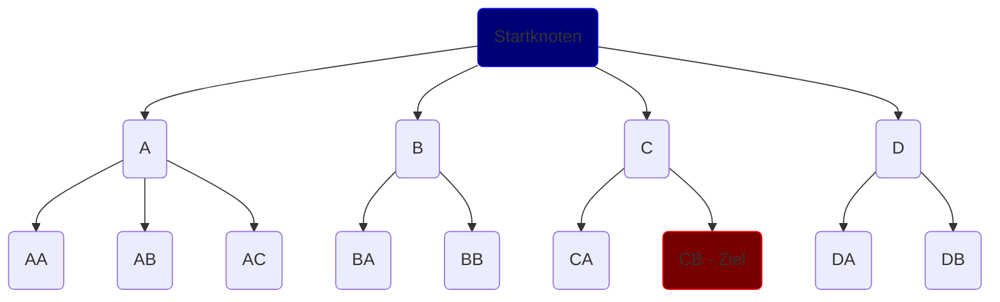
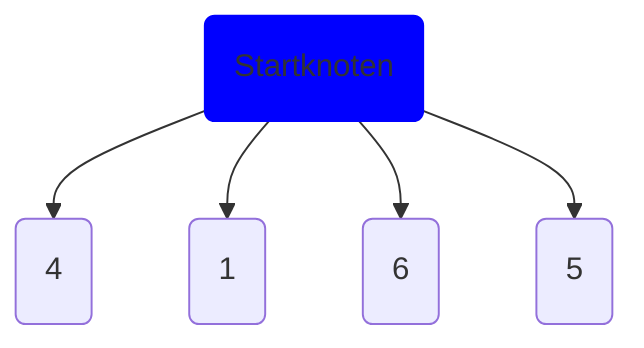
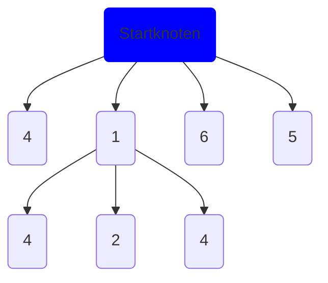
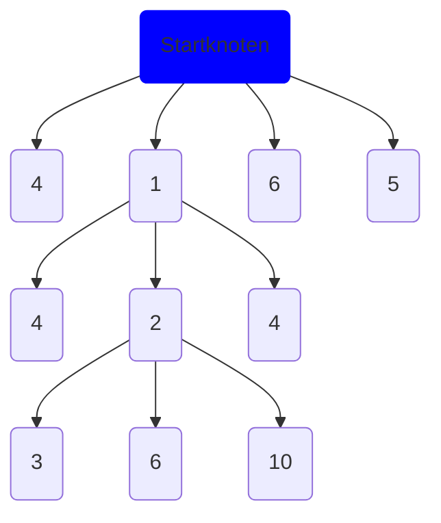
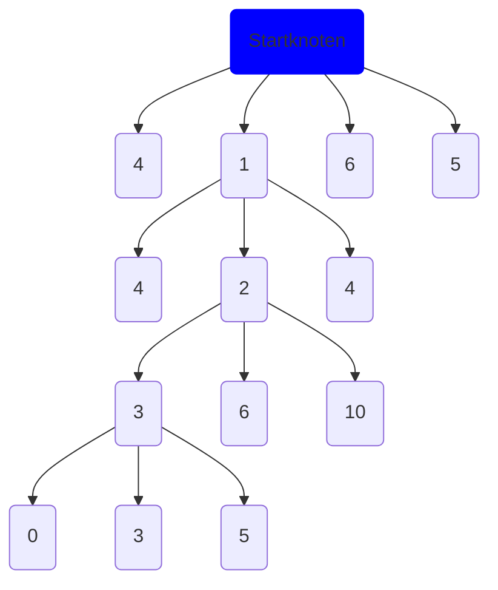

# IDA\* - Iterative Deepening A\*

!!! info inline end "Namensursprung"

    Der Name *IDA\** steht für *iterative deepening A\**, auf Deutsch also *iterative Tiefensuche A\**.
    
    Der Name *A\** kommt daher, dass es früher zwei Algorithmen gab: A1 und A1. Weil A2 der optimale Algorithmus war, nannte
    man ihn A*, weil er symbolisch alle Versionen beinhaltete.
    (vgl. [Stack Overflow](https://stackoverflow.com/questions/29470253/astar-explanation-of-name))

!!! info "Andere Anwendungen"

    Diese Seite bezieht sich zur Anschaulichung auf den Zauberwürfel. IDA\* wird aber auch in anderen Anwendungen 
    genutzt, in denen der kürzeste Weg zwischen zwei Knoten (Zuständen) gebraucht wird, zum Beispiel in Spielen, bei 
    denen sich eine Spielfigur bewegen soll.

!!! info "Begriffe"

    Fachbegriffe, die hier genutzt werden, werden in 
    [Knoten, Zweige und Züge - Begriffserklärung](#knoten-zweige-und-zuge-begriffserklarung) erklärt.

IDA\* durchsucht alle möglichen Züge, bis die Lösung gefunden wurde. Dabei spielt eine Schätzung (Heuristik) eine große
Rolle, da dadurch unnötige Wege ausgeschlossen werden können, um schneller auf die Lösung zu kommen.

## Knoten, Zweige und Züge - Begriffserklärung

Um die Funktionsweise von IDA\* zu verstehen, ist es gut, die folgenden Begriffe zu kennen.

Man kann sich den Suchbaum, in dem IDA\* die Lösung sucht, wie einen umgedrehten Baum, bzw. eine Wurzel vorstellen.
Am Anfang hat man einen Startknoten, von dem verschiedene Zweige abgehen. Diese Verbindung endet in jeweils einem
weiteren Unterknoten, der sich weiter aufteilt.

Ein Zweig ist einfach ein Knoten inklusive aller seiner Unterknoten.

Als Zug bezeichnet man die Verbindung von einem Knoten zum Anderen, durch die sich die Knoten unterscheiden.

EIne Tiefe ist in dem Diagramm eine Ebene (z.B. A, B, C und D). Eine Tiefe von 2 meint aber alle Tiefen, bis die Tiefe
2 erreicht wurde.

In den mathematischen Formeln rund um IDA\* ist $n$ der aktuelle Knoten. Die vorherigen Knoten werden mit $n-1 $, $n-2 $
... dargestellt. Der Startknoten ist $s$.

## Funktionsweise

IDA\* geht alle möglichen Unterzüge (Knoten) für den verdrehten Würfel durch und schätzt für jeden Knoten ab, wie viele
Züge es noch braucht, bis der Würfel gelöst ist. Wenn dieser Wert nicht zu groß ist, werden alle Unterknoten dieses
Knotens durchsucht.

### Beispiel

Angenommen, man hat einen Würfelzustand $s$ der gelöst werden soll.

#### Durchlauf 1

Als Erstes setzt man den Schwellwert auf die Heuristik des Startknotens, also die geschätzten Züge (Knoten) zum Ziel. In
diesem Fall sind das 2.

Dann berechnet man vom Startknoten für jeden Zug die Schätzung der Knoten bis zum Ziel ([Heuristik](#die-heuristik)) und
die Pfadkosten vom Startknoten bis zum aktuellen Knoten ([Pfadkosten](#die-pfadkosten)). Diese zusammengerechnet
ergeben den sogenannten *f-Score*.

/// figure-caption
Erste Knoten mit f-Score
///

Nachdem für die erste Tiefe die f-Scores berechnet wurden, werden sie in aufsteigender Reihenfolge nacheinander
durchgegangen:

Der erste Knoten hat einen f-Score von 1, der ≤ dem Schwellwert ist, also werden die Unterknoten durchsucht.

/// figure-caption
Die f-Scores mit Tiefe 2
///

Der einzige Knoten mit $f(n) \le{t}$ ist der Zweite mit f-Score 2, also wieder alle Unterknoten durchgehen.

/// figure-caption
Tiefe 3
///

Da alle f-Scores der Unterknoten über dem Limit liegen, muss der gesamte Zweig abgebrochen werden.

Und weil es keine Knoten mit kleinerem f-Score mehr gibt, wird der Schwellwert erhöht, und zwar auf den
niedrigsten überschrittenen Wert, damit im nächsten Durchlauf die Lösung gefunden werden kann, aber gleichzeitig
garantiert ist, dass IDA\* die optimale Lösung findet. Dieser Wert ist in diesem Fall 3.

#### Durchlauf 2

Im nächsten Durchlauf geht ersteinmal alles genauso wie davor: Es werden alle f-Scores berechnet und die kleinsten als
Erstes abgesucht.

Weil sich die f-Scores nicht verändert haben, werden wieder die gleichen Knoten durchsucht, bis wieder die tiefste Ebene
erreicht wird.

Der f-Score 3 liegt mittlerweile nicht mehr über dem Limit, also wird er durchsucht.

/// figure-caption
Die nächste und letzte Tiefe
///

f-Score 0 = Lösung!

Dieser Algorithmus wird genauso in dem Programm verwendet, das einzige, was sich unterscheidet, sind die Heuristiken
(Schätzungen der Knoten bis zum Ziel).

## Die Heuristik

Die Heuristik ist eine Schätzung, wie viele Unterknoten es noch braucht, bis der Zielknoten gefunden wird.
Sie wird gebraucht um die aussichtslosen Zweige nicht weiterzuverfolgen und die besten zuerst.

Es gibt verschiedene Heuristiken, die für die verschiedensten Zwecke eingesetzt werden, z.B. die Manhattan-Distanz, die
die kürzeste Verbindung zwischen zwei Punkten darstellt.

Um zu garantieren, dass die optimale Lösung gefunden wird, muss die Heuristik zulässig sein, das heißt, sie darf die
Anzahl der verbleibenden Knoten nie überschätzen.

## Die Pfadkosten

Die Pfadkosten werden von dem Schwellwert verwendet. Sie repräsentieren die Kosten, um vom Startknoten zum aktuellen
Knoten zu kommen.

Man kann beispielsweise sagen, dass ein Zug, egal welcher Art, einem Kostenpunkt entspricht. Oder,
dass ein diagonaler Zug $\sqrt{1^2 + 1^2}$ (der direkten Distanz durch ein Rechteck) Kostenpunkten entspricht, die
horizontalen und vertikalen aber nur 1.

## Der Schwellwert

Damit IDA\* nicht wie BFS (breadth-first search) alle möglichen Zugkombinationen durchgeht, verwendet man einen
Schwellwert, um die Zweige, die einen zu hohen f-Score, haben abzubrechen.

Der f-Score setzt sich auf der Heuristik $h(n)$ und den Pfadkosten $g(n)$ zusammen.

$$
f(n) = h(n) + g(n)
$$

Wenn $f(n)$ für einen Knoten über dem aktuellen Schwellwert $t$ liegt, wird dieser Knoten nicht weiterverfolgt.

Am Anfang ist der Schwellwert die Heuristik des Startknotens, also $h(s)$. Wenn alle Unterknoten mit $f(n) \le{t}$
durchsucht wurden und keine Lösung gefunden wurde, wird der Schwellwert $t$ auf den niedrigsten überschrittenen Wert
gesetzt.